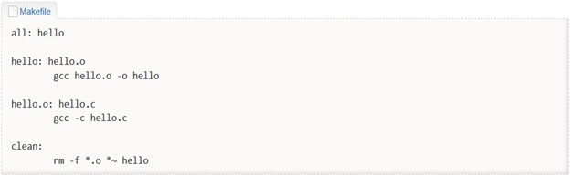
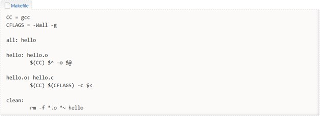

<h1 align="center"> Intro Makefile-uri  </h1>

## Introducere:
Pentru a scrie programe C, atât în cadrul laboratorului, cât și când lucrăm la temele pentru acasă, vom folosi un editor de text (Notepad, Sublime, VSCode) și vom compila programele folosind utilitarul GCC, ce aparține de pachetul GNU Toolchain.

## Compilarea unui program C:
Să presupunem următorul program C: 
```c
// nume fisier: hello.c
#include <stdio.h>

int main() {
    printf("SDA - Hello, World!\n");
    return 0;
}

```
- Folosim GCC pentru a-l compila:
    ```bash
    student@myPC:/$ ls
    hello.c
    student@myPC:/$ gcc hello.c
    student@myPC:/$ ls
    a.out hello.c
    student@myPC:/$ ./a.out
    SDA - Hello, World!
    ```
- Notă: Putem folosi flag-ul __-o__ pentru a specifica numele documentului/executabilului de output/generat.
    ```bash
    student@myPC:/$ gcc hello.c -o hello
    student@myPC:/$ ls
    hello hello.c
    student@myPC:/$ ./hello
    SDA - Hello, World!
    ```

## Makefile-uri
<p align="justify">
<strong>Make</strong> e un tool din pachetul GNU Toolchain, folosit pentru automatizarea compilării programelor. În cazul în care avem un proiect care are un număr foarte mare de fișiere sursă, compilarea întregului proiect de la zero poate dura foarte mult. Prin folosirea utilitarului make putem automatiza compilarea fiecărui fișier separat .c într-un fișier obiect (binar) .o, apoi unirea tuturor fișierelor obiect într-un singur fișier executabil. Fișierul de configurare care stabilește regulile de make se numește <strong>Makefile</strong>.</p>
<p>
Pe lângă toate aceste avantaje ale Makefile-urilor, ele trebuie incluse în arhiva temei pe care o vom urca pe <strong>Moodle.</strong></p>

### Folosire:


 Exemplul prezentat mai sus conține două reguli: all și clean. La rularea comenzii make se execută prima regulă din Makefile (în cazul de față all, nu contează în mod special denumirea). Comanda executată este gcc hello.c -o hello. Se poate preciza explicit ce regulă să se execute prin transmiterea ca argument comenzii make. (comanda make clean pentru a șterge executabilul hello și comanda make all pentru a obține din nou acel executabil).

```bash
student@myPC:/$ ls
hello.c Makefile
student@myPC:/$ make
gcc hello.c -o hello
student@myPC:/$ ls
hello hello.c Makefile
student@myPC:/$ make clean
rm -f hello
student@myPC:/$ ls
hello.c Makefile
student@myPC:/$ make all
gcc hello.c -o hello
student@myPC:/$ ls
hello hello.c Makefile
```

### Sintaxa unei reguli dintr-un fișier Makefile:


- target - este, de obicei, fișierul care se va obține prin rularea comenzii command. După cum s-a observat și din exemplul anterior, poate să fie o țintă virtuală care nu are asociat un fișier.
- prerequisites - reprezintă dependențele necesare pentru a urmări regula; de obicei sunt fișiere necesare(alte target-uri) pentru obținerea țintei.
- ```<tab>``` reprezintă caracterul tab și trebuie neaparat folosit înaintea precizării comenzii.
- command - o listă de comenzi (niciuna, una, oricâte) rulate în momentul în care se trece la obținerea țintei.

### Un alt exemplu de fișier Makefile:



Observăm prezența regulii __all__ care va fi executată implicit.
- __all__: are ca dependență hello și nu execută nicio comandă
- __hello__: are ca dependență hello.o și realizează link-editarea fișierului hello.o
- __hello.o__ are ca dependență hello.c și realizează compilarea fișierului hello.c în fișierul obiect hello.o.

___Notă___: La regula cu target-ul hello.o se observă folosirea opțiunii -c a utilitarului gcc. Aceasta opțiune se folosește pentru a obține doar fișierul obiect din codul sursă. Se oprește procesul de compilare inainte de obținerea executabilului. La final se continua compilarea cu unirea tuturor fișierelor obiect .o într-un fișier executabil.

### Folosirea variabilelor

Un fișier __Makefile__ permite folosirea de variabile. Astfel, un exemplu uzual de fișier __Makefile__ este:


În exemplul de mai sus au fost definite variabilele CC și CFLAGS. Variabia CC reprezintă compilatorul folosit, iar variabila CFLAGS reprezintă opțiunile de compilare utilizate; în cazul de față sunt afișarea tuturor warning-urilor (-Wall) cu suport de depanare (-g).
Variabilele predefinte sunt:
- $@ se expandează la numele target-ului
- $^ se expandează la lista de cerințe (prerequisites - lista de dependențe)
- $< se expandează la prima cerință (la prima dependență)
